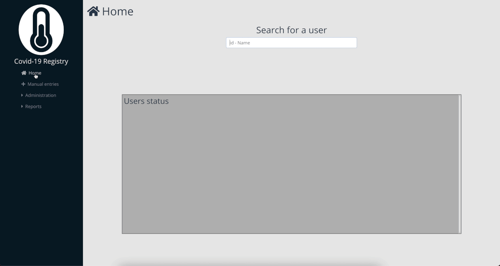
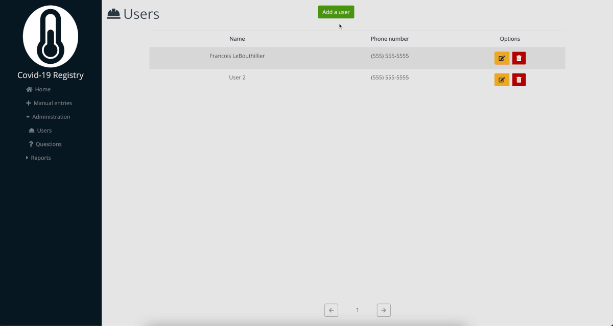
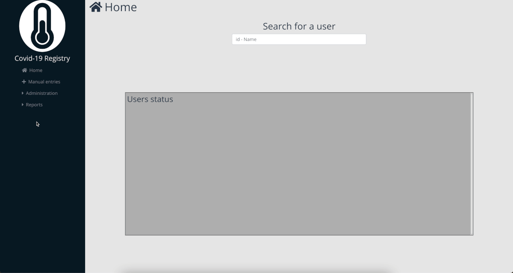

# Covid-19 Registry

This software is used to register the temperature and answer to covid-19 related security questions of people entering a building. In municipal buildings of New Brunswick, everyone must take their temperature every 5 hours. The software has a section to remind people to take their temperature.

The software also gives you statistics on when and how many times every users used the registry.

  
  

  
  

## Software installation

To install the software, you must first create a MySQL Database. Once done, run the createdb.sql script from the \_documentation folder and create a user that can access the newly created tables with SELECT, INSERT, UPDATE and DELETE privileges.

You will then need to create and populate a .env file in the server folder. Here are the variables you need to fill

- covid19-registry DB credentials
  - `DB_HOST=`
  - `DB_USER=`
  - `DB_DATABASE=`
  - `DB_PASSWORD=`
- NodeJS backend port
  - `PORT=`
- Users image filepath for saving
  - `IMAGE_FOLDER=`
  - `IMAGE_PATH=`

Once done, you can quickly start the app by running 
- `npm install; npm run serve` in the covid19-registry folder
- `npm install; node app-covid19-registry.js` in the server folder

This will start the app in development mode. To deploy the application on a real server, you will have to run
`npm install; npm run build` in the covid19-registry 
And use a tool like Nginx or Apache to fully deploy the application.
